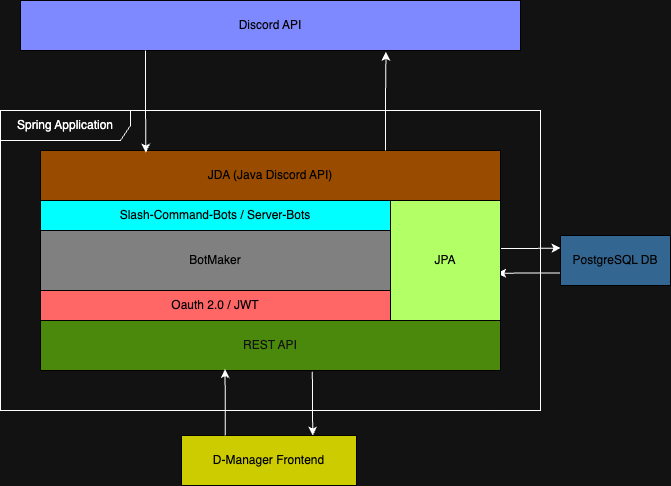

# D-Manager Backend

## Grobarchitektur


 
**Discord API** (Blau)
- **Zweck:** Offizielle Discord-Schnittstelle
- **Funktion:** Ermöglicht Kommunikation mit Discord-Servern, Benutzerverwaltung, Nachrichtenaustausch
- **Technologie:** REST API von Discord

**JDA (Java Discord API)** (Orange/Braun)
- **Zweck:** Java-Wrapper für die Discord API
- **Funktion:** Vereinfacht die Integration von Discord-Funktionen in Java-Anwendungen
- **Rolle:** Bot-Framework für Discord-Interaktionen
- **Features:**
    - Event-basierte Architektur
    - Slash-Command Support
    - Audio-System Integration

**Slash-Command-Bots / Server-Bots** (Türkis)
- **Zweck:** Bot-Implementation für Slash-Commands und Server-Management
- **Funktion:** Verarbeitet Slash-Commands und Server-spezifische Bot-Funktionen
- **Integration:** Nutzt JDA für Discord-Kommunikation
- **Capabilities:**
    - Dynamische Command-Registrierung
    - Server-spezifische Konfiguration

**BotMaker** (Grau)
- **Zweck:** Bot-Erstellungs- und Verwaltungskomponente (Framework)
- **Funktion:** Ermöglicht dynamische Erstellung und Konfiguration von Discord-Bots
- **Rolle:** Zentrale Bot-Management-Logik
- **Features:**
    - Template-basierte Bot-Erstellung
    - Runtime-Konfiguration
    - Bot-Lifecycle Management

**OAuth 2.0 / JWT** (Rosa/Rot)
- **Zweck:** Authentifizierung und Autorisierung
- **Funktion:** Sichere Benutzeranmeldung und Token-basierte Sicherheit
- **Standards:** OAuth 2.0 für Autorisierung, JWT für Token-Management
- **Security Features:**
    - Discord OAuth Integration
    - Session Management

**JPA (Java Persistence API)** (Hellgrün)
- **Zweck:** Datenpersistierung
- **Funktion:** Object-Relational Mapping zwischen Java-Objekten und Datenbank
- **Integration:** Verbindet Anwendungslogik mit PostgreSQL
- **Features:**
    - Entity Relationship Management
    - Query Optimization
    - Transaction Management
    - Connection Pooling

**REST API** (Dunkelgrün)
- **Zweck:** Web-API-Schnittstelle
- **Funktion:** Stellt HTTP-Endpunkte für Frontend und externe Clients bereit
- **Architektur:** RESTful Services für CRUD-Operationen
- **Endpoints:**
    - [Link zu Swagger-Dokumentation](https://github.zhaw.ch/pages/PM4-Gruppe3/api-documentation/docs/swagger-editor/index.html?url=https://github.zhaw.ch/pages/PM4-Gruppe3/api-documentation/discord-manager-api.yaml)

**PostgreSQL DB** (Blau)
- **Zweck:** Relationale Datenbank
- **Funktion:** Persistente Speicherung von Bot-Konfigurationen, Benutzerdaten, Server-Einstellungen
- **Verbindung:** Über JPA angebunden
- **Schema-Bereiche:**
    - User Management
    - Server Templates
    - Audit Logs
    - Permission Systems

**D-Manager Frontend** (Gelb)
- **Zweck:** Benutzeroberfläche
- **Funktion:** Web-Interface für Bot-Management, Server-Konfiguration, Dashboard
- **Kommunikation:** Konsumiert die REST API
- **Features:**
    - Responsive Design
    - Real-time Updates
    - Bot Monitoring Dashboard
    - User Management Interface

# BotMaker Architecture

## Überblick

Die bot-maker Architektur stellt eine Discord-Bot-Architektur dar, die auf Spring Boot und der JDA (Java Discord API) basiert. Diese Architektur wurde entwickelt, um ein modulares und erweiterbares System für die Erstellung und Verwaltung mehrerer Discord-Bots mit unterschiedlichen Funktionalitäten über eine einheitliche Schnittstelle zu bieten. Das Framework zeichnet sich durch seine klare Strukturierung und die Verwendung bewährter Design-Patterns aus, wodurch eine robuste und skalierbare Lösung für Discord-Bot-Entwicklung entstanden ist.

Die Kernphilosophie des Frameworks basiert auf der Idee der Modularität und Wiederverwendbarkeit. Anstatt monolithische Bot-Implementierungen zu erstellen, ermöglicht das System die Entwicklung spezialisierter Bot-Komponenten, die unabhängig voneinander entwickelt, getestet und deployed werden können. Diese Herangehensweise führt zu einer erheblich verbesserten Wartbarkeit und Erweiterbarkeit des Gesamtsystems.

## Kernkomponenten der Architektur

### Bot-Klassifizierungssystem

Das Framework kategorisiert Bots in zwei Haupttypen, die jeweils spezifische Aufgabenbereiche abdecken und unterschiedliche Interaktionsmuster mit Discord-Servern aufweisen.

**Slash Command Bots** sind darauf spezialisiert, Discord-Slash-Commands zu verarbeiten und bieten interaktive Funktionalitäten für Endbenutzer. Diese Bots reagieren auf spezifische Befehle und führen entsprechende Aktionen aus:

- **MUSIC**: Verwaltet Audio-Wiedergabe und Musik-Management mit Funktionen wie Playlist-Erstellung, Lautstärkeregelung und Musiksteuerung
- **TRANSCRIPTION**: Bietet Audio-Transkription und Sprache-zu-Text-Konvertierung für Sprachkanäle und hochgeladene Audiodateien
- **GRADE_CALCULATOR**: Führt akademische Notenberechnungen durch, unterstützt verschiedene Bewertungssysteme und bietet statistische Auswertungen
- **TODO**: Implementiert Aufgabenverwaltung und Todo-Listen mit Kategorisierung, Prioritäten und Erinnerungsfunktionen
- **TIMETABLE**: Verwaltet Zeitpläne und Stundenplanorganisation mit Kalenderfunktionen und Terminerinnerungen

**Server Bots** hingegen konzentrieren sich auf die Administration und Verwaltung von Discord-Servern. Sie bieten umfassende Tools für Server-Administratoren und Moderatoren:

- **GUILD_CONFIG**: Konfiguriert Server-Einstellungen, Standardwerte und Bot-Verhalten auf Server-Ebene
- **GUILD_LIST**: Verwaltet und listet verfügbare Gilden mit detaillierten Informationen und Filteroptionen
- **GUILD_INFO**: Zeigt umfassende Server-Informationen inklusive Statistiken, Mitgliederzahlen und Server-Status
- **GUILD_MEMBER_LIST**: Bietet erweiterte Mitgliederverwaltung mit Such-, Filter- und Sortierungsfunktionen
- **GUILD_INVITE_CREATE**: Erstellt und verwaltet Server-Einladungen mit konfigurierbaren Einstellungen und Ablaufzeiten
- **GUILD_PERMISSION_LIST**: Verwaltet komplexe Berechtigungsstrukturen und zeigt Berechtigungsübersichten
- **GUILD_ROLES_CONFIG**: Konfiguriert Rollen-Einstellungen, Hierarchien und rollenbasierte Zugriffskontrollen
- **GUILD_ROLES_LIST**: Listet und organisiert Server-Rollen mit detaillierten Rechteinformationen
- **GUILD_MEMBER_ROLES_CONFIG**: Verwaltet Rollenzuweisungen für Mitglieder mit Batch-Operationen
- **GUILD_CHANNEL_ROLE_PERMISSION**: Konfiguriert kanalspezifische Rollenberechtigungen mit granularer Kontrolle

### Annotationsbasierte Bot-Registrierung

Das Framework nutzt ein elegantes Annotationssystem für die automatische Bot-Erkennung und -Registrierung. Durch die Verwendung der `@BotIdentifier`-Annotation können Entwickler ihre Bot-Implementierungen eindeutig klassifizieren:

```java
@BotIdentifier(
    category = BotCategory.SLASH_COMMAND,
    slashCommand = SlashCommandBotType.MUSIC
)
public class Bot extends AbstractSlashCommandJdaBot {}
```

Dieses System bietet mehrere entscheidende Vorteile:
- **Automatische Bot-Erkennung**: Während des Anwendungsstarts werden alle annotierten Klassen automatisch gescannt und registriert
- **Typsichere Bot-Kategorisierung**: Compile-time Überprüfung der Bot-Typen verhindert Konfigurationsfehler
- **Vereinfachter Registrierungsprozess**: Entwickler müssen keine manuelle Registrierung durchführen
- **Klare Strukturierung**: Die Annotation macht die Zugehörigkeit und den Zweck eines Bots sofort ersichtlich

### Interaktions-Handling-System

Das Herzstück des Frameworks bildet ein ausgeklügeltes Delegationssystem, das verschiedene Arten von Discord-Interaktionen effizient verarbeitet.

**Delegation Pattern Implementation**

Die Architektur implementiert das Delegation Pattern durch eine Hierarchie spezialisierter Handler-Klassen. Die abstrakte Basisklasse `AbstractDelegationHandler` stellt gemeinsame Funktionalitäten bereit, während spezialisierte Implementierungen die spezifischen Anforderungen verschiedener Interaktionstypen erfüllen:

- **SlashCommandDelegationHandler**: Verarbeitet Slash-Command-Interaktionen mit erweiterten Funktionen wie Bulk-Registrierung und Command-Management
- **ButtonDelegationHandler**: Behandelt Button-Click-Interaktionen mit Unterstützung für Präfix-Matching und dynamische Button-IDs
- **StringSelectDelegationHandler**: Verwaltet Select-Menu-Interaktionen für komplexe Benutzerauswahl-Szenarien
- **ModalDelegationHandler**: Bearbeitet Modal-Form-Interaktionen für strukturierte Dateneingabe

**Thread-Safe Operations**

Alle Handler-Implementierungen gewährleisten Thread-Sicherheit durch konsequente Verwendung von:
- **ConcurrentHashMap**: Für sichere Handler-Speicherung in Multi-Thread-Umgebungen
- **Synchronized Methods**: Für atomare Registrierungs- und Entfernungsoperationen
- **Atomic Operations**: Für konsistente Handler-Zählung und Statusverfolgung

Diese Implementierung ermöglicht es dem System, auch unter hoher Last stabil und konsistent zu funktionieren.

## Event-Flow-Architektur

Der Event-Flow des Systems folgt einem klaren, vorhersagbaren Muster, das eine effiziente Verarbeitung von Discord-Ereignissen gewährleistet:

```
Discord Event → JdaEventListenerService → Specific Handler → Bot Implementation
```

**Detaillierter Event-Flow:**

1. **Discord Event**: Ein Benutzer führt eine Interaktion durch (Slash-Command, Button-Click, etc.)
2. **JdaEventListenerService**: Der zentrale Event-Router empfängt das Ereignis und leitet es an den entsprechenden Handler weiter
3. **Specific Handler**: Der typspezialisierte Delegation-Handler verarbeitet das Ereignis und ruft die registrierte Handler-Funktion auf
4. **Bot Implementation**: Die tatsächliche Bot-Logik wird ausgeführt und eine Antwort generiert

Dieser Ansatz bietet mehrere Vorteile:
- **Klare Separation of Concerns**: Jede Schicht hat eine definierte Verantwortlichkeit
- **Einfache Debugging-Möglichkeiten**: Der Event-Flow ist leicht nachvollziehbar
- **Flexible Erweiterbarkeit**: Neue Interaktionstypen können einfach hinzugefügt werden
- **Konsistente Fehlerbehandlung**: Fehler werden auf jeder Ebene angemessen behandelt

### Command Management System

Das Command Management System bildet eine weitere zentrale Komponente der Architektur und ermöglicht eine flexible und dynamische Verwaltung von Discord-Commands.

**Command Registration und Lifecycle**

Commands durchlaufen einen wohldefinierten Lifecycle, der eine konsistente Verwaltung über alle Bot-Typen hinweg gewährleistet:

1. **Initialization Phase**: Commands werden während des Anwendungsstarts basierend auf den registrierten Bot-Typen initialisiert
2. **Deployment Phase**: Commands werden an die entsprechenden Discord-Server übertragen und aktiviert
3. **Execution Phase**: Commands werden über das Delegation-System verarbeitet und ausgeführt
4. **Update Phase**: Commands können dynamisch pro Server aktualisiert werden, ohne Neustart der Anwendung

**Server-spezifische Command-Verwaltung**

Ein besonderes Merkmal des Systems ist die Fähigkeit, Commands server-spezifisch zu verwalten. Dies ermöglicht:
- **Individuelle Bot-Konfigurationen**: Verschiedene Server können verschiedene Bot-Kombinationen aktivieren
- **Granulare Kontrolle**: Administratoren können gezielt bestimmen, welche Funktionalitäten verfügbar sind
- **Ressourcenoptimierung**: Nur benötigte Commands werden deployed, was die Performance verbessert
- **Compliance-Unterstützung**: Server können Commands deaktivieren, die nicht ihren Richtlinien entsprechen

## Fehlerbehandlungs-Framework

Das Framework implementiert ein umfassendes Fehlerbehandlungssystem, das eine konsistente und benutzerfreundliche Behandlung von Fehlersituationen gewährleistet.

**Zentralisierte Fehlerbehandlung**

Der `InteractionErrorHandler` bildet das Herzstück der Fehlerbehandlung und bietet:
- **Konsistente Fehlerantwort-Formatierung**: Alle Fehler werden in einem einheitlichen Format an Benutzer übermittelt
- **Interaktionstyp-spezifische Behandlung**: Verschiedene Interaktionstypen erhalten angemessene Fehlerbehandlung
- **Graceful Degradation**: Das System bleibt auch bei Fehlern funktionsfähig
- **Umfassende Protokollierung**: Alle Fehler werden detailliert für Debugging-Zwecke protokolliert

**Behandelte Fehlertypen**

Das System ist darauf ausgelegt, eine Vielzahl von Fehlerszenarien zu behandeln:
- **Already Acknowledged Interactions**: Verhindert doppelte Antworten auf Discord-Interaktionen
- **Timeout Errors**: Behandelt Zeitüberschreitungen bei langsamen Operationen
- **Permission Errors**: Informiert Benutzer über unzureichende Berechtigungen
- **Command Execution Failures**: Fängt und behandelt Fehler in der Bot-Logik

## Factory Pattern Implementation

Das Framework nutzt das Factory Pattern für eine typsichere und flexible Bot-Erstellung.

**JdaBotFactory Design**

Die `JdaBotFactory` implementiert eine elegante Lösung für Bot-Instanziierung:
- **Automatische Bot-Discovery**: Scannt den Spring-Context nach verfügbaren Bot-Implementierungen
- **Typsichere Erstellungsmethoden**: Compile-time Überprüfung der Bot-Typen
- **Lazy Initialization**: Bots werden nur bei Bedarf erstellt, was Ressourcen spart
- **Kategoriebasierte Organisation**: Klare Trennung zwischen verschiedenen Bot-Kategorien

**Bot-Instanziierung**

Die Erstellung von Bot-Instanzen erfolgt über typsichere Methoden:
```java
JdaBotEntry musicBot = factory.createSlashCommandBot(SlashCommandBotType.MUSIC);
JdaBotEntry guildBot = factory.createServerBot(ServerBotType.GUILD_CONFIG);
```

Dieser Ansatz bietet mehrere Vorteile:
- **Typsicherheit**: Fehlerhafte Bot-Typ-Zuweisungen werden zur Compile-Zeit erkannt
- **Einheitliche API**: Alle Bot-Erstellungen folgen dem gleichen Muster
- **Einfache Erweiterung**: Neue Bot-Typen können ohne Änderung der Factory-Logik hinzugefügt werden

## Verwendete Design Patterns

### Template Method Pattern
Das Framework nutzt das Template Method Pattern in den abstrakten Basisklassen `AbstractJdaBot` und `AbstractSlashCommandJdaBot`. Diese definieren die gemeinsame Struktur und den Lifecycle aller Bots, während Subklassen spezifische Verhaltensweisen implementieren. Dies führt zu einer konsistenten Lifecycle-Verwaltung über alle Bot-Implementierungen hinweg.

### Strategy Pattern
Verschiedene Interaktionstypen werden durch spezialisierte Strategien behandelt. Diese pluggable Handler-Implementierungen ermöglichen es, zur Laufzeit die geeignete Behandlungsstrategie basierend auf dem Interaktionstyp auszuwählen.

### Observer Pattern
JDA Event Listener beobachten Discord-Events und leiten diese automatisch an die entsprechenden Handler weiter. Diese entkoppelte Event-Handling-Architektur ermöglicht eine flexible und erweiterbare Verarbeitung von Discord-Ereignissen.

### Factory Pattern
Die `JdaBotFactory` kapselt die Bot-Erstellungslogik und bietet typsichere Bot-Instanziierung. Dies abstrahiert die komplexe Erstellungslogik und ermöglicht eine einheitliche Bot-Erstellung.

## Service Layer Architektur

**JdaSlashCommandService** fungiert als zentrale Koordinationsstelle für Command-Management. Dieser Service verwaltet server-spezifische Commands, führt Bot-Typ zu Command-Mappings durch und integriert sich nahtlos mit der Discord API.

**JdaEventListenerService** stellt eine Event-Delegation-Facade bereit, die Handler-Registrierung verwaltet, thread-sichere Interaktionsverarbeitung gewährleistet und zentralisierte Protokollierung und Monitoring bereitstellt.

**JdaBotService** übernimmt das Bot-Lifecycle-Management, ermöglicht Bot-Instanz-Abruf, organisiert Bots nach Typen und koordiniert zwischen verschiedenen Services.

## Konfiguration und Initialisierung

Das Framework integriert sich vollständig in Spring Boot und nutzt dessen Funktionalitäten für automatisches Component-Scanning, Dependency Injection und konfigurationsbasierte Einstellungen. Die JDA-Konfiguration umfasst Gateway-Intent-Management, Bot-Token-Konfiguration und Event-Listener-Registrierung.

Der Initialisierungsflow folgt einem klaren Muster: Nach dem Start der Spring Boot-Anwendung wird die JDA-Instanz konfiguriert und erstellt, Bot-Komponenten werden gescannt und registriert, Event-Listener werden angehängt, Commands werden bei Discord registriert, und schließlich ist das System bereit für Interaktionen.

## Vorteile dieser Architektur

**Modularität** steht im Zentrum des Designs. Jeder Bot-Typ wird unabhängig entwickelt, es gibt klare Trennung der Verantwortlichkeiten, neue Bot-Typen können einfach hinzugefügt werden, und Änderungen an bestehenden Bots haben minimale Auswirkungen auf das Gesamtsystem.

**Skalierbarkeit** wird durch thread-sichere Operationen, effiziente Event-Behandlung, ressourcenschonendes Design und Unterstützung für mehrere Discord-Server gewährleistet.

**Wartbarkeit** profitiert von klarer Code-Organisation, konsistenten Patterns, umfassender Fehlerbehandlung und extensiver Protokollierung für Debugging-Zwecke.

**Erweiterbarkeit** ermöglicht es, neue Interaktionstypen einfach hinzuzufügen, pluggable Handler-Systeme zu nutzen, annotationsbasierte Registrierung zu verwenden und neue Bot-Typen über das Factory Pattern zu erstellen.

## Entwicklungsworkflow

**Hinzufügen eines neuen Bots** ist ein streamlined Prozess:
1. Erstellen einer Bot-Implementierung, die `AbstractSlashCommandJdaBot` oder `AbstractJdaBot` erweitert
2. Hinzufügen der `@BotIdentifier`-Annotation mit entsprechendem Typ
3. Implementierung der erforderlichen abstrakten Methoden
4. Registrierung von Commands und Handlers
5. Automatische Erkennung und Registrierung des Bots

**Hinzufügen neuer Interaktionstypen** erfolgt durch:
1. Erstellen eines neuen Delegation-Handlers, der `AbstractDelegationHandler` erweitert
2. Implementierung der interaktionsspezifischen Logik
3. Registrierung des Handlers beim `JdaEventListenerService`
4. Hinzufügen entsprechender Enum-Werte bei Bedarf

Diese Architektur bietet eine robuste, skalierbare Grundlage für Discord-Bot-Entwicklung mit klarer Trennung der Verantwortlichkeiten, Typsicherheit und umfangreichen Anpassungsmöglichkeiten.

# Installation Guide

## Requirements
- Java 21
- Keine Gradle Installation notwendig, da das Projekt den Gradle Wrapper enthält
- Docker ist optional, aber empfohlen für die Datenbank- und Bot-Containerisierung

## Install Docker

### Windows
1. Download Docker Desktop from the [Docker website](https://www.docker.com/products/docker-desktop).
2. Run the installer and follow the instructions.
3. After installation, open Docker Desktop and wait for it to start.
4. Make sure Docker is running by checking the Docker icon in the system tray.

#### Donwload via Chocolately
You can also install Docker using Chocolatey, a package manager for Windows. Open a command prompt with administrative privileges and run the following command:

```bash
choco install docker-desktop
```

## Gradle

To install the project, you need to have Gradle installed on your machine. You can download it from the [Gradle website](https://gradle.org/install/).
You can also use the Gradle Wrapper, which is included in the project. To use the wrapper, run the following command in the project directory:

```bash
./gradlew build
```
This will download the necessary Gradle version and build the project.

### Gradle bootRun
To run the project using Gradle, you can use the `bootRun` task. This will start the Spring Boot application. Run the following command in the project directory:

```bash
./gradlew bootRun
```

## Create Docker Image

Um das Backend in einem Docker-Container auszuführen, müssen Sie ein Docker-Image erstellen. Stellen Sie sicher, dass Sie sich im Verzeichnis des Projekts befinden und führen Sie den folgenden Befehl aus:

```bash
docker build -t backend:latest .
```

## Run Docker Compose

Um das Backend auf einem Docker-Container auszuführen, können Sie Docker Compose verwenden. Stellen Sie sicher, dass Sie sich im Verzeichnis des Projekts befinden und führen Sie den folgenden Befehl aus:

```bash
docker compose up -d
```


# Jacoco Test Abdeckung

Auf folgendem Link kann die Jacoco Test Abdeckung für das ganze Backend eingesehen werden: [Jacoco Test Coverage](jacoco_testabdeckung/Discord-Manager-BE.pdf)

Unter dem Ordner "jacoco_testabdeckung/html" befindet sich die HTML-Version der Testabdeckung, die eine detaillierte Ansicht der Abdeckung pro Klasse und Methode bietet.